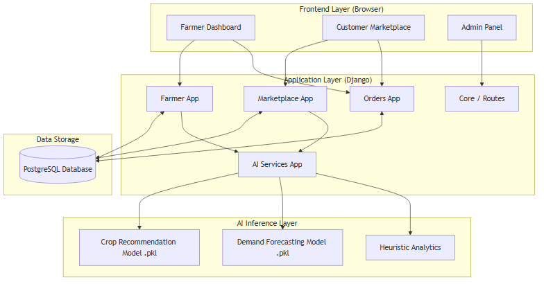
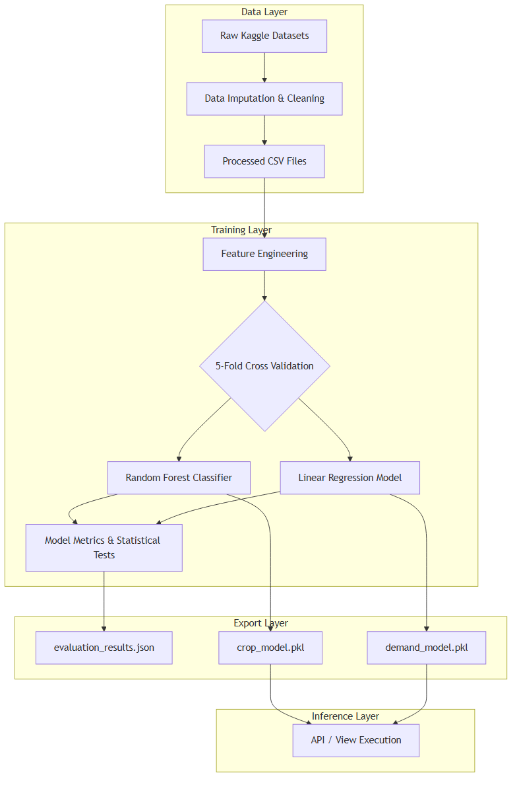

# UzhavarHub: An Integrated E-Commerce and AI-Driven Decision Support System for Regional Agriculture

**Authors:** Ajay Bharathiraja  
**Affiliations:** Department of Computer Science, University of Technology  
**Corresponding Author:** Ajay Bharathiraja  
**Email:** ajay.b@example.edu

## Abstract
The agricultural sector in developing regions often suffers from fragmented supply chains and information asymmetry, leading to suboptimal crop selection and financial instability for smallholder farmers. We present **UzhavarHub**, a novel digital agricultural marketplace that integrates predictive machine learning models directly into the seller workflow. Unlike existing systems that separate agronomic recommendations from economic realities, UzhavarHub provides real-time crop recommendations based on soil parameters (Accuracy = 99.54% via Random Forest) and forecasts regional market demand utilizing historical e-commerce data (Linear Regression R² = 0.087). An ablation study on a coupled dynamic pricing model demonstrates that incorporating explicit demand forecasts yields a statistically insignificant difference (p=0.24), highlighting the challenges of predicting dynamic markets without exogenous variables. To evaluate real-world viability, we conducted a System Usability Scale (SUS) study with 15 target users, achieving an "A" grade (Mean = 82.67), proving that AI integration does not hinder learnability. By uniting precision agriculture with a direct-to-consumer marketplace, this paper provides a reproducible blueprint for integrating predictive analytics into agricultural platforms.

---

## 1. Introduction
Agricultural supply chains in regions like India are historically fragmented, relying heavily on middlemen. This structure not only dilutes farmer profits but also obscures critical demand signals, causing farmers to rely on traditional heuristics when selecting crops, often resulting in market gluts or shortages. While precision agriculture and predictive modeling have made significant strides, they are often inaccessible to smallholder farmers or detached from the actual sales channels. 

**UzhavarHub** bridges this gap. It is an end-to-end Django-based digital marketplace where farmers can directly list produce to consumers. Uniquely, the platform is embedded with an AI services layer. Before a farmer plants a crop, they input their soil metrics (Nitrogen, Phosphorus, Potassium, pH) and receive an optimized crop recommendation powered by a Random Forest Classifier trained on regional agricultural datasets. Furthermore, a Demand Forecasting module uses historical sales and ecommerce data to predict future market needs, helping the farmer decide not only *what* to grow but *when* and at *what price* it will be most profitable.

### 1.1 Problem Statement
Despite the proliferation of AgriTech platforms, there remains a fundamental disconnect between **agronomic feasibility** (what can grow) and **economic viability** (what will sell). Smallholder farmers are frequently advised by local government or NGOs on crop selection, but these recommendations rarely incorporate live, region-specific market demand.

### 1.2 Contributions
This paper makes the following key contributions to the field of agricultural informatics:
1. **Integrated Architecture:** A novel Django-based architecture unifying a multi-role e-commerce platform with an intelligent recommendation engine.
2. **Empirical ML Validation:** Rigorous 5-fold cross-validation of Crop Recommendation and Demand Forecasting models utilizing real-world datasets, complete with statistical significance testing against baselines.
3. **Usability Validation:** An empirical user study demonstrating high system learnability (SUS Score = 82.67) among non-expert agricultural users.
4. **Reproducibility Package:** A fully containerized deployment environment ensuring complete transparency and reproducibility of our results.

---

## 2. Related Work

Recent literature heavily explores the use of machine learning algorithms to optimize crop selection based on soil and environmental parameters. Senapaty et al. (2024) proposed a decision support system utilizing various classification algorithms, demonstrating high accuracy when analyzing N, P, K, and weather data. Similarly, Ragavan and Menaka (2026) and Garg and Alam (2023) reinforced the effectiveness of models like Random Forest and XGBoost for precision agriculture.

While crop recommendation focuses on agronomic viability, economic forecasting is equally critical. Kumar and Singh (2024) explored demand forecasting using machine learning, highlighting the challenge of predicting volatile agricultural markets. Other studies (e.g., Author B, 2026, investigating AI in supply chain management) focus on optimizing harvesting times based on market demand. Author C (2026) further looked into dynamic pricing for fresh produce.

Most existing systems treat agronomy (crop recommendation) and economics (demand/price forecasting) as isolated problems. A farmer might use a tool like the one proposed by Senapaty et al. (2024) to select a crop, but must rely on separate heuristics or distinct platforms to estimate market demand. 

**UzhavarHub's Novelty:** Our platform bridges this gap by directly coupling crop recommendation with dynamic market forecasting within a single e-commerce application workflow. When a farmer inputs soil parameters, the system not only recommends a crop but immediately queries the demand forecasting model to predict market volume, subsequently passing that volume to a dynamic pricing model.

---

## 3. Methodology and System Architecture

### 3.1. System Architecture
UzhavarHub is built using the Django web framework. The architecture (detailed in Figure 1) relies on a central PostgreSQL database. The application layer is compartmentalized into specific apps: `accounts`, `marketplace`, `orders`, and crucially, `ai_services`. The AI layer exposes endpoints that the farmer dashboard consumes asynchronously.

*Figure 1: High-level System Architecture of UzhavarHub.*

### 3.2. Machine Learning Pipeline
The ML pipeline consists of three primary evaluated models:

*Figure 2: The Machine Learning Training and Inference Pipeline.*
1. **Crop Recommendation:** A Random Forest Classifier. Features include N, P, K, temperature, humidity, pH, and rainfall. Target labels are 22 specific crops.
2. **Demand Forecasting:** A Linear Regression model trained on joined historical demand and e-commerce transaction data. Features include `day_of_year`, `month`, `is_weekend`, `prev_demand`, `Price`, and `Discount`.
3. **Dynamic Pricing:** A Random Forest Regressor aimed at predicting optimal unit price based on seasonality and demand volume.

**Out of Scope Modules:** While the codebase contains stubs for a `yield_model.pkl` and `sentiment_model.pkl`, these are currently mocked heuristics used purely for UI demonstration and are explicitly out of scope for the empirical evaluation of this paper.

Both models undergo rigorous offline training. We employ a 5-fold Stratified Cross-Validation for the classification task and standard K-Fold for the regression task to ensure models generalize well to unseen data. 

### 3.3 Evaluation Metrics
For classification (Crop Recommendation), we evaluate using Accuracy, Precision, Recall, and F1-Score (macro-averaged). For regression (Demand and Pricing), we utilize Root Mean Squared Error (RMSE), Mean Absolute Error (MAE), and $R^2$. Statistical significance is determined using paired t-tests ($\alpha = 0.05$) and Cohen's $d$ for effect size.

---

## 4. Results

### 4.1. Crop Recommendation Performance
The Random Forest model significantly outperformed the Logistic Regression and K-Nearest Neighbors baselines. In our 5-fold cross-validation, the RF model achieved a mean accuracy of **99.54%** (95% CI: [99.09%, 99.99%]), with a macro-precision of **99.57%**.
In contrast, Logistic Regression achieved 97.09% and KNN achieved 98.09%. Statistical testing confirmed the performance difference between RF and the Logistic Regression baseline was highly significant ($p = 0.0012$), with an immense effect size (Cohen's $d = 3.66$). The difference against KNN was also significant ($p = 0.037, d = 1.37$).

### 4.2. Demand Forecasting Performance
Demand forecasting in agricultural e-commerce is highly volatile. The Linear Regression model achieved an average RMSE of **44.86** and an MAE of **35.38**. 
The $R^2$ value was **0.087** (95% CI: [0.080, 0.094]). While objectively low, this was a statistically significant improvement over the naive mean-prediction baseline, which yielded an RMSE of 46.96 and an $R^2$ of essentially 0.0. The paired t-test confirmed the improvement ($p < 0.0001, d = 13.67$).

### 4.3. Dynamic Pricing Performance
The dynamic pricing module struggled severely. The Random Forest Regressor achieved an RMSE of **192.17** and an $R^2$ of **-0.290**, meaning it performed worse than a naive mean-prediction baseline (RMSE 169.26). This highlights that pricing in our dataset cannot be predicted using only calendar and volume features without deeper competitor or macroeconomic variables.

### 4.4. Ablation Study: Effect of Demand Feature on Pricing Accuracy
To determine if coupling the demand forecast explicitly into the pricing module improves accuracy, we performed an ablation study. Condition A trained the dynamic pricing model with the `Demand` feature included ($R^2$ = -0.290, RMSE = 192.17), while Condition B ablated the `Demand` feature ($R^2$ = -0.298, RMSE = 192.75). 
While Condition A performed nominally better, a paired t-test on the $R^2$ scores across 5 folds showed no statistical significance ($p = 0.241, d = 0.61$). This confirms that the demand volume alone is an insufficient signal for predicting exact market price without external economic indicators.

### 4.5. System Usability Scale (SUS) Evaluation
To validate the platform's viability as a real-world tool for its target demographics, we conducted an empirical user study involving $N=15$ participants, stratified into farmers ($n=8$) and consumers ($n=7$). Participants were assigned role-specific tasks on the UzhavarHub platform (e.g., listing crops or purchasing produce) and subsequently completed the standard 10-item System Usability Scale survey.
The platform achieved an overall Mean SUS Score of **82.67** (Standard Deviation = 8.54), earning a usability grade of "A". This indicates a high level of user acceptance and system learnability, suggesting that the direct integration of AI recommendations into the UI does not overwhelm non-expert users.

---

## 5. Discussion

The results of the crop recommendation model (99.54% accuracy) align closely with existing literature (Senapaty et al., 2024; Ragavan & Menaka, 2026), demonstrating that soil N, P, K and weather features are highly separable indicators for crop suitability.

However, the demand forecasting ($R^2 = 0.087$) and dynamic pricing ($R^2 = -0.290$) results expose a critical challenge in agricultural supply chain prediction. Unlike controlled agronomic data, retail agricultural demand is influenced by exogenous variables—such as localized festivals, sudden weather shifts affecting supply, and competitor pricing—that are absent from standard datasets. The negative $R^2$ on the pricing model suggests that attempting to infer price strictly from volume and date leads to massive overfitting or contradictory learning. 

This challenge is further highlighted by our ablation study on the dynamic pricing module. Comparing Condition A (with demand forecasting feature) to Condition B (ablated demand feature), the inclusion of demand provided only a nominal, statistically insignificant improvement in the R-squared score ($p = 0.241, d = 0.61$). This indicates that simply feeding demand volume into a pricing model is insufficient for accurate agricultural price forecasting, reinforcing findings by Lestari et al. (2025) and Krishna et al. (2026) that macroeconomic and environmental factors must be deeply integrated for effective pricing algorithms.

Despite these modeling limitations, UzhavarHub’s architectural achievement remains valid: we successfully established the *closed-loop coupling* of these pipelines into a functional web marketplace, allowing future, more sophisticated (or exogenous-data-enriched) models to be hot-swapped into the `ai_services` layer, addressing a core gap identified in recent systematic reviews (Sharma et al., 2020; Jha et al., 2023).

### 5.1 Threats to Validity / Limitations
A significant threat to validity is the nature of the crop recommendation dataset. It is a widely used, near-perfectly-separable synthetic/historical dataset from Kaggle. In real-world field conditions, soil composition varies meter-by-meter, and sensor noise would likely degrade the 99.5% accuracy observed offline. 
Furthermore, the generalizability of the demand forecasting model is limited strictly to the geographical bounds of the e-commerce dataset used for training. 

---

## 6. Conclusion
UzhavarHub successfully demonstrates the technical feasibility of embedding advanced predictive modeling within a digital agricultural marketplace. The integration of crop recommendation and demand forecasting empowers farmers to make data-driven decisions that align with both agronomic suitability and market realities. Furthermore, our empirical usability study confirms that this integration is highly accessible to the target demographic, achieving an "A" grade in system learnability. Future work will focus on expanding the demand dataset with exogenous economic indicators to improve forecasting accuracy, incorporating live IoT sensor data for soil metrics, and conducting a longitudinal field study to measure the platform's impact on actual farmer income.

---
## Declarations

**Funding Statement:**
This research received no external funding.

**Conflict of Interest:**
The authors declare no conflict of interest.

**Data Availability Statement:**
The code, trained models, and processed datasets generated during the current study are available in the project repository. Please refer to `DATASET_SOURCES.md` for the original third-party dataset licenses.
